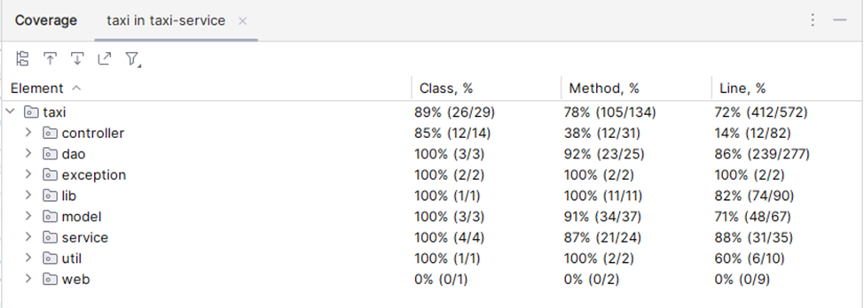

# TAXI CERVICE
# 🚀 Project description
A simple web-application that supports database work, authentication, registration, adding, updating, viewing and deleting items from DB and other CRUD operation, logging requests/responses to the application to the database. The project is a web application for taxi management that uses Java and JavaServer Pages (JSP) technology to create dynamic pages. Design patterns and segregation of duties are used to create a clean and easily extensible architecture. Taxi Service is a web application created to manage drivers, cars and manufacturers in a taxi company. The application allows you to add, update, delete drivers, cars and manufacturers, as well as assign drivers to cars.
# Features
- Adding new drivers, cars and manufacturers to the database. 
- Update information about drivers, cars and manufacturers. 
- Removing drivers, cars and manufacturers from the database. 
- Assignment of drivers to specific cars. 
- Logging of user actions 
# 🏗️ Project structure
- **src/main/java** - Java code sources.
   - **taxi.controller** - controllers process HTTP requests and interact with related services and models. 
  - **taxi.dao** - database access classes. The Data Access Object template is used to interact with the database. Interfaces and their implementations provide CRUD (create, read, update, delete) operations. 
The **DAO** is responsible for maintaining communication with the database, allowing the creation, reading, updating, and deletion of data.
  - **taxi.exception** - this class handles exceptions that may occur during query execution and displays an appropriate message to the user. 
  - **taxi.lib** - additional classes for control inversion and other general tasks. 
  - **taxi.model** - classes representing the data model. There are **Car, Driver,** and **Manufacturer** classes that represent Car, Driver, and Manufacturer objects. Relationships between models, such as drivers for each car, are defined. 
  - **taxi.service** - services for managing business logic. Interfaces and their implementations for managing drivers, cars and manufacturers. Services implement business process logic such as adding, deleting, retrieving a list, etc. 
  - **taxi.util** - helper classes and utilities are located that provide useful functions and simplify certain processes for your project, including working with the database and other common operations. The overall goal of the taxi.util package is to simplify and standardize work with common tasks and resources. 
  - **taxi.web.filter** - filters are located that process HTTP requests before they reach the controllers.

- **src/main/resources** - there are files for creating a database and configuring the logger.
    - **init_db.sql** instructions for creating a database
    - **log4j2.xml** logger configuration file

- **taxi.webapp** - web components such as filters and controllers. JSP templates generate pages with data coming from the backend. JSTL is used to display data and manage page structure. 
- **src/main/test/java** - a package of testing errors in the work of the project 
**The total coverage of methods and code is:** 

# 💡 Technologies used
- Java (v 11.0.17) 
- Servlet & JSP (v 4.0.1) 
- YSTL (Javaserver Pages Standard Tag Library v 4.0.1) 
- MySQL (v 8.0.28) 
- Tomcat (v 9.0.50)
- JUnit Jupiter test engine.(JUnit5) 
- Log4j logging framework (v 2.17.1)

# 📚 Instructions for  launching the project

1. Create a MySQL database named **taxi** and execute the SQL script to create the tables (**src/main/resources/init_db.sql**).

2. Download the project and import it into your workspace (IDE) as a **Maven project.**

3. In the file **src/main/java/taxi/util/ConnectionUtil.java**, specify the data to connect to your MySQL database (URL, username and password).

4. In the file **src/main/resources/log4j2.xml** in line 7 enter in parameters fileName=**"absolute_path_to_your_log_file**">

5. Start the application on your server (**Apache Tomcat**).

6. Open a browser and navigate to <a href="http://localhost:8080/">http://localhost:8080/</a> to interact with the application.

# 🔧 Other divisions
- Author: **Yurii Ivanov** 
- Contact information: <a href="mailto:ivanovyura76@gmail.com">ivanovyura76@gmail.com</a>  
- License: Copyright (c) 2023 by Yurii Ivanov. Taxi service is free and open-source software licensed under the MIT License.